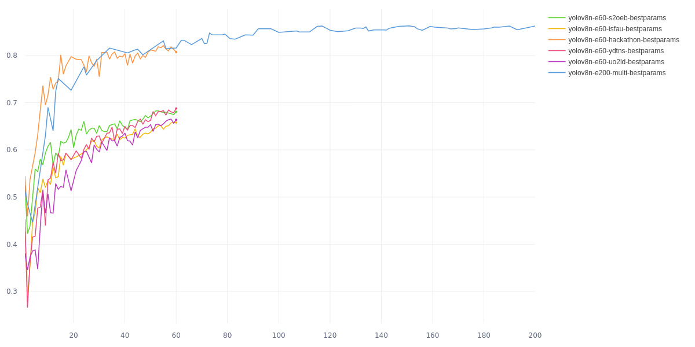
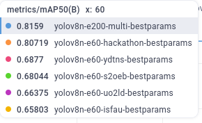

# bart: models

The bart models are trained with the [Ultralytics](https://docs.ultralytics.com/) framework, which lets us train a new [YOLO](https://pyimagesearch.com/2022/04/04/introduction-to-the-yolo-family/) model using a custom dataset and also provides an integration with [Comet](https://www.comet.com/) for monitoring purposes.

There are several phases involved in the training of a model, starting with the obtention of the images. All of the datasets used for training were taken from [Roboflow](https://universe.roboflow.com/search?q=billboards), using the [download-datasets.py](./datasets/download-datasets.py) script. Some of the downloaded datasets were combined in order to get a greater number of training images, while others were used exclusively. Each dataset is split in three parts, which are used on different parts of the process: training images, validation images and testing images. All of the datasets are then specified on the [data.yaml](./datasets/data.yaml) file, and we manually comment and uncomment the ones we are using on each experiment on a case by case basis.

## Training

The training of a new model starts with the training phase, which involves having the model run through the training images several times (in what are called epochs) and on each of those times checking the current results with the validation images, before recalibrating the training for the next epoch.

In addition to the training images we also use some "background images" (or "negative images") on the training split, so that we can reduce the false positives. This images should be around ~10% of the total number of training images and can be downloaded with the [negative-images.py](./datasets/negative-images.py) script.

We use the [train.py](./train.py) script for the training phase:

```
$ python3 train.py --help
[INFO] Starting...
usage: Train a custom YOLOv8 model [-h] [-m MODEL] [-s IMGSZ] [-e EPOCHS]
                                   [-hp HYPERPARAMS]
                                   [-n NAME | --dataname DATANAME]

Script to train a YOLOv8 model against a particular dataset

options:
  -h, --help            show this help message and exit
  -m MODEL, --model MODEL
                        The relative file path to the YOLOv8 base model that
                        will be used to extend training. If instead of a path
                        it's [nano, small, medium, large, xlarge], the native
                        YOLOv8 base model will be used.
  -s IMGSZ, --imgsz IMGSZ
                        The size of the training dataset images
  -e EPOCHS, --epochs EPOCHS
                        The number of epochs to train the model
  -hp HYPERPARAMS, --hyperparams HYPERPARAMS
                        The relative file path to the hyperparameters file
  -n NAME, --name NAME  The name of the experiment
  --dataname DATANAME   A suffix added to the experiment name for easier
                        identification of the dataset used

```

We optionally use the [tune.py](./tune.py) script for hyper-parameter tuning, which involves doing several passes of the same training phase with slight variations of the parameters used, trying to find a better set of params to use on the final training of the model.

After the training phase we run the validation phase with the [validate.py](./validate.py) script on our "test" split, which is comprised of unseen images by our models so that we can check how it would perform on "the real world".

## Results

We ended up with 6 different models, with the first one being the most robust one as it mixes several datasets, while the rest are trained on single datasets.

All of the models were trained on top of the Nano YOLOv8 base model, using the same [hyperparameters file](./bestparams/yolov8n-i30-e25-multi-ray.yaml) and then were all validated with all of the available testing images.

```sh
# We trained the multi-dataset model with 200 epochs, and the rest of them with 60
COMET_API_KEY="XXX" python3 train.py --epochs 200 -hp bestparams/yolov8n-i30-e25-multi-ray.yaml --dataname multi
COMET_API_KEY="XXX" python3 train.py --epochs 60 -hp bestparams/yolov8n-i30-e25-hackaton-ray.yaml --dataname hackaton
COMET_API_KEY="XXX" python3 train.py --epochs 60 -hp bestparams/yolov8n-i30-e25-isfau-ray.yaml --dataname isfau
COMET_API_KEY="XXX" python3 train.py --epochs 60 -hp bestparams/yolov8n-i30-e25-uo2ld-ray.yaml --dataname uo2ld
COMET_API_KEY="XXX" python3 train.py --epochs 60 -hp bestparams/yolov8n-i30-e25-ydtns-ray.yaml --dataname ydtns
COMET_API_KEY="XXX" python3 train.py --epochs 60 -hp bestparams/yolov8n-i30-e25-s2oeb-ray.yaml --dataname s2oeb
```

The models were monitored with comet, but keep in mind that the results here reflect on how well they progressed over their own validation images, not over the general test split.




<details>
  <summary>Validation Results</summary>
  <pre>
$ python3 validate.py -m models/yolov8n-e200-multi-bestparams/weights/best.pt
Ultralytics YOLOv8.1.24 🚀 Python-3.10.12 torch-2.1.1+cu121 CPU (Intel Core(TM) i7-10510U 1.80GHz)
Model summary (fused): 168 layers, 3005843 parameters, 0 gradients, 8.1 GFLOPs
val: Scanning /home/delmazo/Documents/bart/yolo8/datasets/bb-ydtns/test/labels.cache... 1327 images, 9 backgrounds, 0 corrupt: 100%|██████████| 1327/13
WARNING ⚠️ Box and segment counts should be equal, but got len(segments) = 393, len(boxes) = 3142. To resolve this only boxes will be used and all segments will be removed. To avoid this please supply either a detect or segment dataset, not a detect-segment mixed dataset.
                 Class     Images  Instances      Box(P          R      mAP50  mAP50-95): 100%|██████████| 83/83 [01:54<00:00,  1.38s/it]
                   all       1327       3142      0.823      0.273       0.54       0.34
Speed: 1.4ms preprocess, 76.6ms inference, 0.0ms loss, 0.5ms postprocess per image
<br>
$ python3 validate.py -m models/yolov8n-e60-hackathon-bestparams/weights/best.pt
Ultralytics YOLOv8.1.24 🚀 Python-3.10.12 torch-2.1.1+cu121 CPU (Intel Core(TM) i7-10510U 1.80GHz)
Model summary (fused): 168 layers, 3005843 parameters, 0 gradients, 8.1 GFLOPs
val: Scanning /home/delmazo/Documents/bart/yolo8/datasets/bb-ydtns/test/labels.cache... 1327 images, 9 backgrounds, 0 corrupt: 100%|██████████| 1327/13
WARNING ⚠️ Box and segment counts should be equal, but got len(segments) = 393, len(boxes) = 3142. To resolve this only boxes will be used and all segments will be removed. To avoid this please supply either a detect or segment dataset, not a detect-segment mixed dataset.
Class Images Instances Box(P R mAP50 mAP50-95): 100%|██████████| 83/83 [02:13<00:00, 1.60s/it]
all 1327 3142 0.782 0.254 0.496 0.315
Speed: 1.7ms preprocess, 89.3ms inference, 0.0ms loss, 0.5ms postprocess per image
<br>
$ python3 validate.py -m models/yolov8n-e60-isfau-bestparams/weights/best.pt
Ultralytics YOLOv8.1.24 🚀 Python-3.10.12 torch-2.1.1+cu121 CPU (Intel Core(TM) i7-10510U 1.80GHz)
Model summary (fused): 168 layers, 3005843 parameters, 0 gradients, 8.1 GFLOPs
val: Scanning /home/delmazo/Documents/bart/yolo8/datasets/bb-ydtns/test/labels.cache... 1327 images, 9 backgrounds, 0 corrupt: 100%|██████████| 1327/13
WARNING ⚠️ Box and segment counts should be equal, but got len(segments) = 393, len(boxes) = 3142. To resolve this only boxes will be used and all segments will be removed. To avoid this please supply either a detect or segment dataset, not a detect-segment mixed dataset.
Class Images Instances Box(P R mAP50 mAP50-95): 100%|██████████| 83/83 [01:58<00:00, 1.43s/it]
all 1327 3142 0.897 0.314 0.602 0.36
Speed: 1.5ms preprocess, 80.0ms inference, 0.0ms loss, 0.6ms postprocess per image
<br>
$ python3 validate.py -m models/yolov8n-e60-uo2ld-bestparams/weights/best.pt
Ultralytics YOLOv8.1.24 🚀 Python-3.10.12 torch-2.1.1+cu121 CPU (Intel Core(TM) i7-10510U 1.80GHz)
Model summary (fused): 168 layers, 3005843 parameters, 0 gradients, 8.1 GFLOPs
val: Scanning /home/delmazo/Documents/bart/yolo8/datasets/bb-ydtns/test/labels.cache... 1327 images, 9 backgrounds, 0 corrupt: 100%|██████████| 1327/13
WARNING ⚠️ Box and segment counts should be equal, but got len(segments) = 393, len(boxes) = 3142. To resolve this only boxes will be used and all segments will be removed. To avoid this please supply either a detect or segment dataset, not a detect-segment mixed dataset.
Class Images Instances Box(P R mAP50 mAP50-95): 100%|██████████| 83/83 [01:51<00:00, 1.34s/it]
all 1327 3142 0.864 0.349 0.597 0.364
Speed: 1.4ms preprocess, 75.0ms inference, 0.0ms loss, 0.5ms postprocess per image
<br>
$ python3 validate.py -m models/yolov8n-e60-ydtns-bestparams/weights/best.pt
Ultralytics YOLOv8.1.24 🚀 Python-3.10.12 torch-2.1.1+cu121 CPU (Intel Core(TM) i7-10510U 1.80GHz)
Model summary (fused): 168 layers, 3005843 parameters, 0 gradients, 8.1 GFLOPs
val: Scanning /home/delmazo/Documents/bart/yolo8/datasets/bb-ydtns/test/labels.cache... 1327 images, 9 backgrounds, 0 corrupt: 100%|██████████| 1327/13
WARNING ⚠️ Box and segment counts should be equal, but got len(segments) = 393, len(boxes) = 3142. To resolve this only boxes will be used and all segments will be removed. To avoid this please supply either a detect or segment dataset, not a detect-segment mixed dataset.
Class Images Instances Box(P R mAP50 mAP50-95): 100%|██████████| 83/83 [02:23<00:00, 1.73s/it]
all 1327 3142 0.885 0.378 0.626 0.39
Speed: 1.8ms preprocess, 97.5ms inference, 0.0ms loss, 0.4ms postprocess per image
<br>
$ python3 validate.py -m models/yolov8n-e60-s2oeb-bestparams/weights/best.pt
Ultralytics YOLOv8.1.24 🚀 Python-3.10.12 torch-2.1.1+cu121 CPU (Intel Core(TM) i7-10510U 1.80GHz)
Model summary (fused): 168 layers, 3005843 parameters, 0 gradients, 8.1 GFLOPs
val: Scanning /home/delmazo/Documents/bart/yolo8/datasets/bb-ydtns/test/labels.cache... 1327 images, 9 backgrounds, 0 corrupt: 100%|██████████| 1327/13
WARNING ⚠️ Box and segment counts should be equal, but got len(segments) = 393, len(boxes) = 3142. To resolve this only boxes will be used and all segments will be removed. To avoid this please supply either a detect or segment dataset, not a detect-segment mixed dataset.
Class Images Instances Box(P R mAP50 mAP50-95): 100%|██████████| 83/83 [02:01<00:00, 1.46s/it]
all 1327 3142 0.881 0.413 0.636 0.412
Speed: 1.5ms preprocess, 81.9ms inference, 0.0ms loss, 0.3ms postprocess per image

  </pre>
</details>

| Model Name | Filename                         | # Training Images | mAP50 (training) | mAP (validation) |
| ---------- | -------------------------------- | ----------------- | ---------------- | ---------------- |
| multi      | yolov8n-e200-multi-bestparams    | 2514              | 0.862 (#1)       | 0.540 (#5)       |  
| hackathon  | yolov8n-e60-hackathon-bestparams | 4503              | 0.807 (#2)       | 0.496 (#6)       |  
| isfau      | yolov8n-e60-isfau-bestparams     | 7137              | 0.658 (#6)       | 0.602 (#3)       |  
| uo2ld      | yolov8n-e60-uo2ld-bestparams     | 1903              | 0.663 (#5)       | 0.597 (#4)       |  
| ydtns      | yolov8n-e60-ydtns-bestparams     | 2719              | 0.687 (#3)       | 0.626 (#2)       |  
| s2oeb      | yolov8n-e60-s2oeb-bestparams     | 8155              | 0.680 (#4)       | 0.636 (#1)       |  
